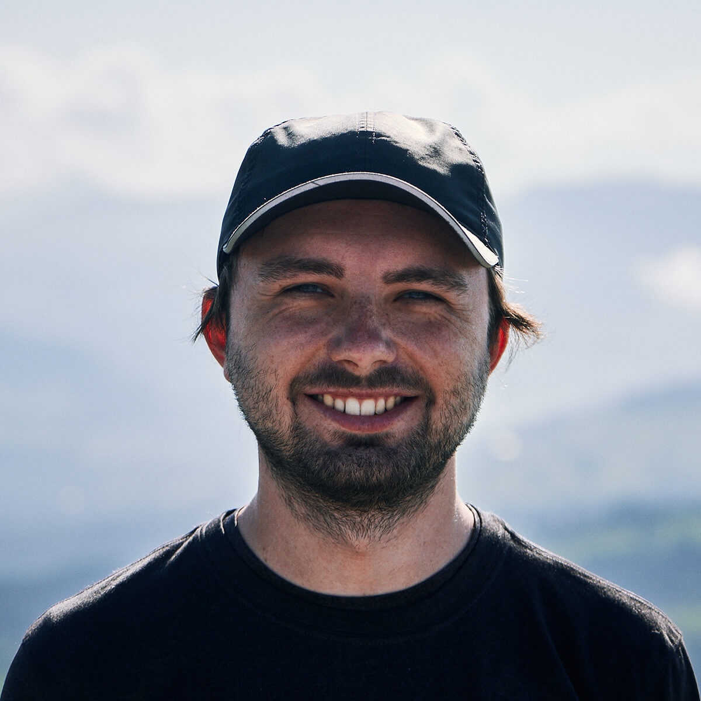

import { MDXLayout as PageLayout } from "../../components/blocks/mdx-layout"
import { SEO } from "../../components/seo"

<SEO
  title="About"
  description="A little bit about me and what I'm passionate about, what I do at work, and what else I do in my free time. Maybe you're also into photography or hiking?"
  noIndex
/>

export default PageLayout

# About

**Hi, I'm Lennart 👋**  
I'm a designer turned software engineer from Darmstadt, Germany. I currently work at [Gatsby](https://www.gatsbyjs.com) on the open source software (OSS).
I'm passionate about working on open source projects & building thriving communities around them. 
My [OSS code](https://github.com/LekoArts) has been used by thousands of people & I regularly share educational content in the form of [posts](/writing), [presentations](/appearances), and [videos](/appearances).

## Hobbies

If I'm not coding I like to spend my time with playing tennis & hiking in the mountains. I then often take my camera with me to take [landscape photos](/art/photography) and also particularly enjoy editing the photos at the computer afterwards. I also enjoy creating other forms of [art](/art) such as 3D art or UI design. Lastly, my kindle is always filled with fantasy & sci-fi books 📚.
